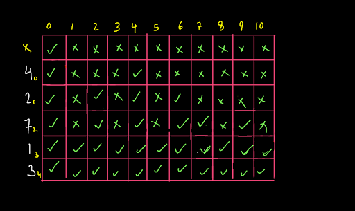

### Написать функцию - ```sostavChisla(massivChisel: number[], chislo: number)```.



Функция должна находить все возможные комбинации чисел из ```massivChisel```,
сумма которых равна ```chislo```. 

При этом:
1) ```massivChisel``` содержит, только уникальные положительные числа (> 0);
2) в комбинации не должно быть повторений чисел;
3) все комбинации должны быть уникальными.
```
{
    chislo: 8,
    massivChisel: [1, 2, 3, 4, 5, 6, 7, 8],
    result: [[1, 3, 4], [1, 2, 5], [3, 5], [2, 6], [1, 7], [8]]
},
```
Для проверки работоспособности функции запустить ```runTests()```

---------

*Решение задачи основанно на [этом алгоритме](https://www.pepcoding.com/resources/data-structures-and-algorithms-in-java-levelup/dynamic-programming/print_all_paths_with_target_sum_subset/topic)*
