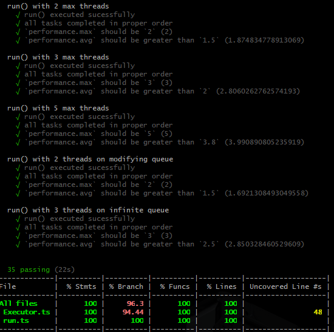

### Тестовое задание "Планировщик задач"



* Каждая отдельная задача выглядит следующим образом:
  ```
  interface Task {
    targetId: number
    action: 'init' | 'prepare' | 'work' | 'finalize' | 'cleanup'
  }
  ```

  Использовать специальные хуки `_onComplete` или `_onExecute` нельзя, они используются для диагностики и логирования.

* Есть специальный класс `Executor` (`src/Executor.ts`), который умеет исполнять одну задачу:
  ```
  Executor.executeTask(task: Task): Promise<void>
  ```

  В решении нельзя использовать внутреннее состояние `Executor`, только `IExecutor.executeTask()`.

Надо реализовать асинхронную функцию, которая получает на вход очередь
задач `Iterable<Task>` и максимальное кол-во одновременных "потоков" `maxThreads` и возвращает промис, который будет разрезолвлен, когде все задачи
отработают.

```
async function run(queue: Queue, maxThreads = 0): Promise<{...}>
```
При `maxThreads == 0` ограничения на кол-во одновременных "потоков" нету.

Функция должна исполнить задачи максимально быстро, стараясь как можно больше задач исполнить параллельно. Но, есть ограничение (в нем заключается основная сложность задачи): в один момент времени `Executor` не может исполнять несколько разных задач с одним и тем же `Task.targetId`, но при этом он может исполнять много разных задач с разными `Task.targetId` параллельно.

* Например, если мы вызовем  
  ```
  executor.executeTask({ targetId: 0, action: 'init' });
  executor.executeTask({ targetId: 0, action: 'prepare' });
  ```  
  то, второй вызов кинет исключение.

* При этом  
  ```
  executor.executeTask({ targetId: 0, action: 'init' });
  executor.executeTask({ targetId: 1, action: 'prepare' });
  ```  
  или
  ```
  await executor.executeTask({ targetId: 0, action: 'init' });
  await executor.executeTask({ targetId: 0, action: 'prepare' });
  ```  
  отработают нормально.

При взятии задачи из очереди (вызов `iterator.next()` или итерация через `for ... of`) она автоматически удаляется из очереди, при этом существующие итераторы не инвалидируются. При этом надо учесть, что очередь может быть пополнена во время исполнения задач, а также, никто не гарантирует, что очередь конечна в принципе.

Критерий остановки исполнения функции `run()`: все полученные из очереди задачи выполнены и в очереди больше нету новых новых задач.

Все задачи для одного и того же `Task.targetId` должны быть исполнены последовательно в том порядке, в котором они находятся в очереди.

## Настройка окружения:

* `Node.js version >= 12`

## Установка и подготовка

`npm install`

## Разработка решения
* Заготовка для функции `run()` лежит в `./src/run.ts`. 
* Никакие другие файлы, кроме `./src/run.ts` менять нельзя. 
* Обвязочный код в `run.ts` менять нельзя
* Внутри одного вызова `run()` создавать дополнительные эксземпляры `Executor` нельзя.

## Самостоятельная проверка правильности решения

Для удобства я написал тесты для `run()`, которые проверяют правильность её работы.

`npm run test`

Также тесты генерят детальные отчеты-логи `./test/*.log.html`.
